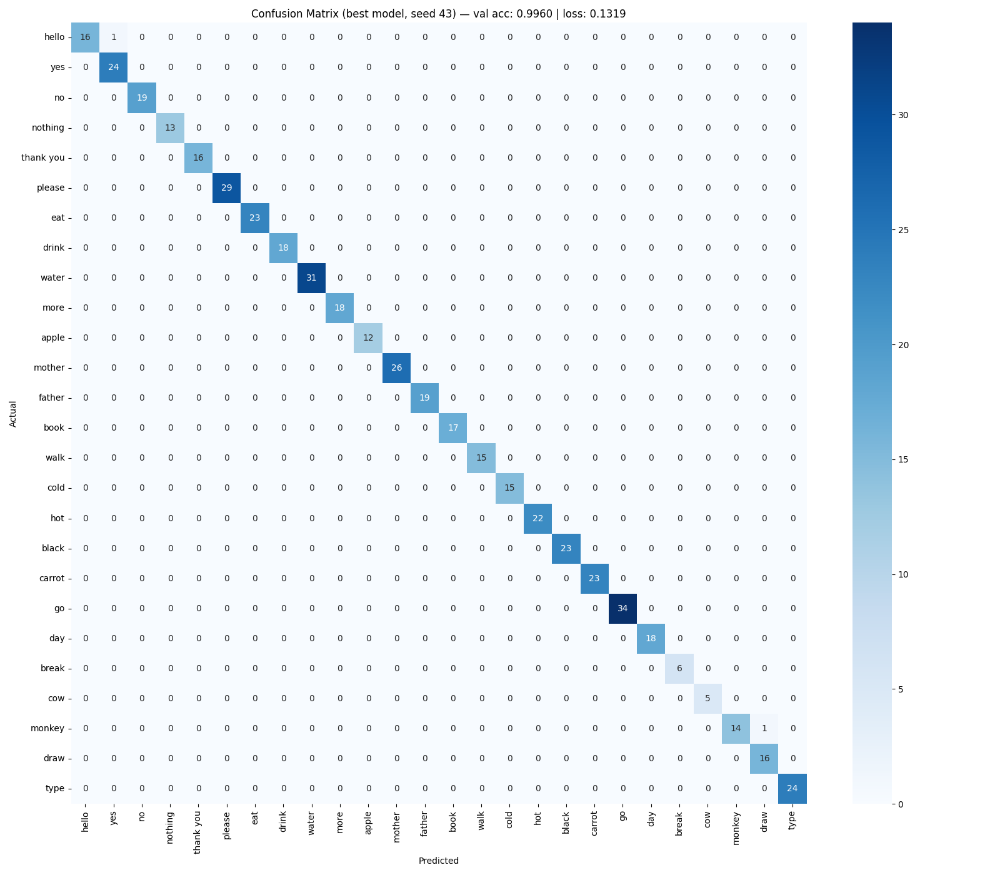

# SignLanguageTrack

Real-time ASL recognition in the browser — no server, no installation. A webcam captures hand gestures, MediaPipe extracts skeletal landmarks, and a 2-layer LSTM classifies sequences of 30 frames into one of 25 signs.

**[Live Demo →](https://qasim-a.github.io/sign-language-track)**

<!-- DEMO VIDEO — embed here once recorded -->
<!--  -->

---

## How It Works

```
Webcam → MediaPipe (hands + pose) → 225-feature vector × 30 frames
       → LSTM classifier → FSM (READY → SIGNING → PREDICTING) → UI
```

Each frame produces a 225-dimensional feature vector:

| Source | Points | Features |
|---|---|---|
| Left hand | 21 landmarks × (x, y, z) | 63 |
| Right hand | 21 landmarks × (x, y, z) | 63 |
| Body pose | 33 landmarks × (x, y, z) | 99 |
| **Total per frame** | | **225** |

30 frames are accumulated into a sequence `[30 × 225]`, which the LSTM processes as a temporal signal to capture the motion arc of each sign.

---

## Architecture

### Model

A 2-layer LSTM (`input=225 → hidden=128 → FC=26`) trained in PyTorch and exported to ONNX for browser inference. The model takes only the final hidden state for classification — the sequence is consumed, not the intermediate outputs.

```python
LSTM(input_size=225, hidden_size=128, num_layers=2, dropout=0.3)
→ FC(128, 26)
→ softmax → argmax
```

### Inference State Machine

A three-state FSM manages sign boundaries — this is what makes real-time recognition practical rather than noisy:

```
READY ──── hand appears ────→ SIGNING ──── 8 frames no hand ────→ PREDICTING
  ↑                                                                     │
  └─────────────── 1.5s timeout OR new hand detected ──────────────────┘
```

- **READY**: waiting for a hand to enter frame
- **SIGNING**: accumulating landmark frames into the rolling buffer; brief occlusions are tolerated (frames continue to accumulate rather than cutting the sequence short)
- **PREDICTING**: inference fires once on the completed sequence; result displayed for 1.5s then resets

The FSM prevents the model from firing continuously and ensures a clean boundary between consecutive signs.

### Two Deployment Paths

| | Local (Flask) | Browser (GitHub Pages) |
|---|---|---|
| Runtime | Python + PyTorch | ONNX Runtime Web |
| Inference | Server-side | On-device (no server) |
| Latency | Webcam → Flask → UI | Webcam → browser |
| Privacy | Local only | Fully local, no data sent |
| Dependencies | Python, MediaPipe, OpenCV | None (CDN-loaded) |

The PyTorch model is exported to ONNX via `src/convert_to_onnx.py`; `docs/inference.js` is a faithful port of `app.py` — same feature vector layout, same FSM logic, same zero-padding for short sequences, same suppression of the `nothing` class.

---

## Dataset

~2,500 sequences across 25 signs, collected via a custom pipeline (`collect_data.py`). Each sequence is 30 frames × 225 features, recorded at webcam framerate.

| Sign | Clean | Messy | Total |
|---|---|---|---|
| hello | 100 | 0 | 100 |
| yes | 100 | 20 | 120 |
| no | 90 | 20 | 110 |
| nothing | 70 | 0 | 70 |
| thank you | 70 | 20 | 90 |
| please | 100 | 20 | 120 |
| eat | 60 | 40 | 100 |
| drink | 100 | 20 | 120 |
| water | 100 | 40 | 140 |
| more | 90 | 10 | 100 |
| apple | 70 | 10 | 80 |
| mother | 90 | 10 | 100 |
| father | 70 | 20 | 90 |
| book | 70 | 30 | 100 |
| walk | 70 | 10 | 80 |
| cold | 70 | 10 | 80 |
| hot | 80 | 10 | 90 |
| black | 70 | 40 | 110 |
| carrot | 70 | 30 | 100 |
| go | 90 | 20 | 110 |
| day | 70 | 20 | 90 |
| break | 50 | 20 | 70 |
| cow | 50 | 0 | 50 |
| monkey | 50 | 20 | 70 |
| draw | 50 | 40 | 90 |
| type | 70 | 40 | 110 |

### Clean vs. Messy Sequences

A key design decision: every sign was recorded in two modes.

**Clean** sequences start with hands in the sign's initial position at frame 1 and end at the final position at frame 30 — ideal, controlled examples.

**Messy** sequences simulate real-world entry/exit conditions: hands entering from off-frame before the sign, or dropping away after it. This directly addresses the distribution shift between training data and live inference — in the app, hands always start from rest, not from the start position of a sign.

The clean/messy ratio per sign was determined empirically by watching which signs were being confused with each other in real-time testing and adding targeted messy sequences to fix boundary artifacts.

---

## Training

```
python src/preprocess.py   # builds data/X.npy, data/y.npy
python src/train.py        # trains and saves models/asl_model.pth
```

Key decisions in `train.py`:

- **Fixed seed (43)** across `random`, `numpy`, and `torch` — ensures identical train/val splits and weight initialization on every retrain
- **80/20 split** — deterministic with the fixed seed
- **Composite save criterion** — model is only saved when validation accuracy ≥ 98%, and among qualifying epochs, saved when val acc improves *or* ties with lower loss (better-converged model preferred)
- **Best-model reload before evaluation** — confusion matrix is generated from the best saved checkpoint, not the final epoch's weights

### Results

Validation accuracy: **99.6%** | Loss: **0.1319**



The confusion matrix is nearly a clean diagonal across all 25 signs. Two misclassifications in the validation set: `hello → yes` (1) and `monkey → draw` (1).

Real-time accuracy on a full 25-sign live test suite: **~85%**, with the gap explained by natural signing variation — hands partially out of frame, lighting changes, signing speed. This is addressed through messy sequences and the FSM's occlusion tolerance.

---

## Project Structure

```
SignLanguageTrack/
├── src/
│   ├── collect_data.py     # webcam data collection with clean/messy modes
│   ├── preprocess.py       # assembles X.npy / y.npy from per-sign .npy files
│   ├── train.py            # LSTM training, checkpointing, confusion matrix
│   ├── convert_to_onnx.py  # exports asl_model.pth → asl_model.onnx
│   └── inference.py        # standalone inference script (local, no Flask)
├── models/
│   ├── asl_model.pth       # PyTorch weights (current)
│   ├── asl_model.onnx      # ONNX export for browser inference
│   └── confusion_matrix.png
├── docs/                   # GitHub Pages deployment (served as static site)
│   ├── index.html
│   ├── style.css
│   ├── main.js
│   ├── inference.js        # browser-side port of app.py (MediaPipe + ONNX)
│   └── asl_model.onnx
├── data/                   # per-sign folders of .npy sequences (gitignored)
├── notebooks/
│   └── explore.ipynb       # exploratory analysis
├── templates/index.html    # Flask UI (local version)
├── static/
│   ├── css/style.css
│   └── js/main.js          # local app frontend + structured test suite
├── app.py                  # Flask server (local version)
└── requirements.txt
```

---

## Running Locally

```bash
git clone https://github.com/qasim-a/sign-language-track
cd sign-language-track
pip install -r requirements.txt
python app.py
# open http://localhost:5000
```

---

## Stack

**Training**: Python · PyTorch · MediaPipe · OpenCV · scikit-learn · NumPy  
**Local app**: Flask · PyTorch · MediaPipe · OpenCV  
**Browser app**: MediaPipe.js · ONNX Runtime Web · Vanilla JS  
**Deployment**: GitHub Pages (static, no server)

---

## Supported Signs

`hello` `yes` `no` `nothing` `thank you` `please` `eat` `drink` `water` `more` `apple` `mother` `father` `book` `walk` `cold` `hot` `black` `carrot` `go` `day` `break` `cow` `monkey` `draw` `type`